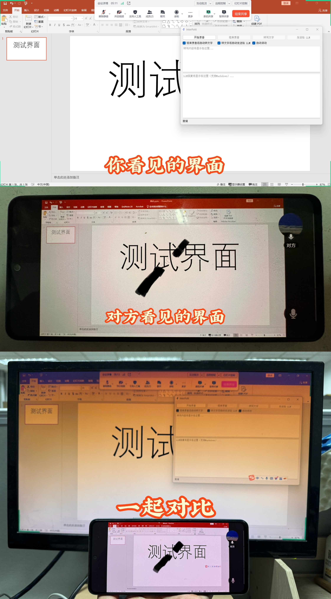

# Dev AI

[English](README_en.md)

[](https://www.microsoft.com/windows)
[](https://creativecommons.org/licenses/by-nc/4.0/)
[](https://www.python.org/)
[](https://pypi.org/project/PyQt5/)
[](https://www.ffmpeg.org/)
[](https://www.openai.com/)
[](https://cloud.siliconflow.cn/i/TzKmtDJH)

Dev AI is an AI-based assistant tool that captures audio from Windows input and output devices, transcribes the audio into text, and then calls an LLM (Large Language Model) API to generate responses. The project comprises three main modules—recording, transcription, and AI response—**aiming to support legitimate personal study, work, and research.**

Some beta testers have reported that this tool may be helpful in scenarios such as interviews, meetings, and learning. For instance, it can serve as an AI interview assistant in online meeting software by capturing the interviewer’s audio and generating responses. However, please note that **this tool is intended solely for learning and communication purposes and must not be used for any improper activities.**

Through testing, this tool can leverage third-party utilities to hide its interface so that it is not recorded by screen recording or screen sharing software. However, the tool itself does not possess interface hiding capabilities. **Whether you use third-party tools is not the author’s responsibility; the risk is solely borne by the user.**


## Table of Contents

- [Dev AI](#Dev AI)
  - [Table of Contents](#table-of-contents)
  - [Inspiration](#inspiration)
  - [Features](#features)
  - [Project Structure](#project-structure)
  - [Installation \& Dependencies](#installation--dependencies)
    - [System Dependencies](#system-dependencies)
    - [Python Dependencies](#python-dependencies)
  - [Configuration](#configuration)
    - [Detailed Configuration Instructions](#detailed-configuration-instructions)
      - [API](#api)
      - [Recording Device Index](#recording-device-index)
  - [Usage Instructions](#usage-instructions)
    - [Testing Individual Modules](#testing-individual-modules)
    - [Launching the Graphical User Interface](#launching-the-graphical-user-interface)
    - [Notes](#notes)
    - [Handling Screen Sharing and UI Hiding (if you wish to keep the tool hidden during meetings)](#handling-screen-sharing-and-ui-hiding-if-you-wish-to-keep-the-tool-hidden-during-meetings)
  - [TODO](#todo)
  - [Contribution](#contribution)
  - [⚠️ Disclaimer](#️-disclaimer)
  - [License](#license)


## Inspiration

Inspired by [YT-Chowww/InterviewCopilot](https://github.com/YT-Chowww/InterviewCopilot)

## Features

- **Audio Capture**  
  Uses [LoopbackRecorder](src/audio_capture.py) to record audio from the system (with **support for loopback devices**) and saves it as a WAV file.

- **Speech Transcription**  
  Performs **local audio transcription** using the [Whisper](https://github.com/openai/whisper) model. It supports various model sizes (default is the `base` model).

- **AI-Assisted Response**  
  Analyzes the transcribed text and generates responses by calling the LLM API (configured in `config.ini`). It supports **streaming responses with real-time UI updates**.

- **Graphical User Interface**  
  A clean GUI built with PyQt5 that supports recording, transcription, sending text to the LLM, and renders LLM responses with **Markdown support**.


## Project Structure

```
C:.
│   config.ini
│   logo.png
│   main.py
│   main_cmd.py
│   README.md
│   requirements.txt
│
├── output
└── src
    │   audio_capture.py
    │   llm_client.py
    │   transcriber.py
    │   __init__.py
    │
    └── utils
        │   config_loader.py
        │   __init__.py
```

- **config.ini**  
  Configuration file containing the API endpoint, API key, model to use, device indices, default prompt, etc.

- **logo.png**  
  Application icon used in the GUI.

- **main.py / main_cmd.py**  
  Entry points for the program, responsible for launching the GUI and the overall workflow.

- **output/**  
  Directory for storing recorded audio files.

- **requirements.txt**  
  Lists the Python package dependencies (such as PyQt5, markdown2, whisper, openai, etc.).

- **src/**  
  Contains the core modules:  
  - `audio_capture.py`: Audio recording module.  
  - `transcriber.py`: Speech transcription module.  
  - `llm_client.py`: Client for calling the LLM API.  
  - `utils/`: Contains additional utility classes and configuration loader modules.

## Installation & Dependencies

### System Dependencies

- **FFmpeg**  
  This project depends on [FFmpeg](https://www.gyan.dev/ffmpeg/) for some audio processing tasks. Please ensure FFmpeg is properly installed and added to your system's PATH.  
  - **Example Installation Methods**:  
    - **For Windows Users**:  
      - Using [Scoop](https://scoop.sh/):
        ```bash
        scoop install ffmpeg
        ```  
      - Or download the Windows precompiled version (see [Download Link](https://www.gyan.dev/ffmpeg/builds/ffmpeg-release-full.7z)).  
      - Add the `bin` folder from the downloaded directory (e.g., `C:\Users\USERNAME\scoop\apps\ffmpeg\7.1.1\bin`) to your system PATH.
    - **For macOS Users**:  
      ```bash
      brew install ffmpeg
      ```
    - The Whisper project mentions that "You may need rust installed as well," so if you encounter issues with `transcriber.py`, consider installing Rust (though it usually works without it).

### Python Dependencies

It is recommended to create a virtual environment using Miniconda or Anaconda (suggested Python version: 3.10):

```bash
conda create -n interview python=3.10
conda activate interview
```

Then install the required Python packages:

```bash
pip install -r requirements.txt
```

## Configuration

Please modify the `config.ini` file in the root directory according to your setup, including:

- **API_URL**: The LLM API endpoint.
- **API_KEY**: Your API access key.
- **MODEL**: The model name to be used (e.g., `deepseek-ai/DeepSeek-R1-Distill-Qwen-7B' | 'deepseek/deepseek-r1-distill-llama-70b:free`). Other model names can be viewed on the Siliconflow website (see [Official Link](https://cloud.siliconflow.cn/i/TzKmtDJH)).
- **SPEAKER_DEVICE_INDEX** and **MIC_DEVICE_INDEX**: The indices of the recording devices, depending on your system configuration. It is recommended to read the [Recording Device Index](#recording-device-index) and [Notes](#notes) sections.
- **OUTPUT_DIR**: Directory to store the recorded audio files.
- **WHISPER_MODEL_SIZE**: Size of the Whisper model. Options include tiny, `base`, `small`, `medium`, `large`, `turbo`.
- **DEFAULT_PROMPT**: It is the default prompt word **spliced at the forefront of the text sent to LLM**, which can be adjusted according to the usage scenario. For example, "You are an expert in XX, and the text you are about to receive comes from XX. Please provide a reasonable and concise answer based on this:"

### Detailed Configuration Instructions

#### API
- It is recommended to register on openrouter or Siliconflow to obtain an `API_KEY`. New users can get a free credit from siliconflow (invite code `TzKmtDJH`) which is sufficient for some time.
- On the website, go to the left sidebar -> API Keys -> Create a new API key. Replace the long string (e.g., `sk-xxxxxxxxxxxxxxxxxxxxxxxxxxxxx`) in `config.ini` with your new API key.
- **Other services supporting the OpenAI API can be used as well** by replacing `API_URL` and `API_KEY` (though Siliconflow is recommended because the tool uses the free `deepseek-ai/DeepSeek-R1-Distill-Qwen-7B` model).

#### Recording Device Index
- The default `SPEAKER_DEVICE_INDEX` is set to -1, which automatically finds an available default WASAPI loopback device (usually recording what is heard through your speakers or headphones). If issues occur, run `audio_capture.py` to list all available devices and manually specify the correct device. You may also adjust this parameter to record from the microphone instead.
change 'MIC_DEVICE_INDEX' mine is 2, according to your device you can change it. You can find it using python script which is you can get it from chatgpt😉

```bash
python src/audio_capture.py
```

## Usage Instructions

### Testing Individual Modules

Each core module (recording, transcription, and LLM client) contains simple test code. You can run the following files individually to verify that each module works correctly:

- `src/audio_capture.py`  — Implements audio recording (lists system audio devices).
- `src/transcriber.py`  — Implements audio transcription (the model will be automatically downloaded on first run).
- `src/llm_client.py` — Implements the LLM client (calls the LLM API and returns responses).

### Launching the Graphical User Interface

Run `main.py` to launch the full Dev AI GUI:

```bash
python main.py
```

In the GUI, you can perform the following operations sequentially:

- **Start Recording**: Click the "Start Recording" button. The program will generate a unique filename and start recording audio.
- **Stop Recording**: Click the "Stop Recording" button to end the recording. The audio file is saved in the `output` directory.
- **Transcribe Audio**: After recording (or manually triggering), the transcription module converts the audio to text and displays it in the interface.
- **Send to LLM**: Once transcription is complete, the text can be sent to the LLM to generate an AI response, which will be displayed with Markdown support.
- **Modify Transcribed Text and Resend to LLM** if needed.

If you prefer running the tool in a command-line mode, you can use `main_cmd.py`: but it still under maintenance🤣

```bash
python main_cmd.py
```

### Notes

- **Recording Devices**: Depending on your system, you may need to adjust `SPEAKER_DEVICE_INDEX` and `MIC_DEVICE_INDEX` in `config.ini`.
- **Environment Variables**: Ensure FFmpeg is installed and added to the PATH; otherwise, audio processing might be affected.
- **Testing**: It is recommended to test each module individually to confirm that audio recording, transcription, and LLM response work correctly before running the full GUI.
- **installing**: Also after installation of modules dont forget to add on path to the environment variables
### Handling Screen Sharing and UI Hiding (if you wish to keep the tool hidden during meetings)

- Use [shalzuth/WindowSharingHider](https://github.com/shalzuth/WindowSharingHider) to hide the UI—an excellent tool that is both convenient and effective!
- **Taskbar Icon Hiding**:
  - You can use Windows’ built-in taskbar icon hiding features, or simply move the taskbar to a secondary monitor.
  - Alternatively, you may find third-party hiding tools (feel free to search for one that suits your needs).
- Using [turbotop](https://www.savardsoftware.com/turbotop/) can keep the window always on top—another very useful tool.
- **Important**: The order of operations may affect the outcome:
  - First, use turbotop to set the window to always on top.
  - Then, use WindowSharingHider to hide the UI.
  - If the results are not satisfactory, try altering the order.



## TODO

- [ ] Add more detailed usage examples or screenshots (GUI operation examples, terminal output, etc.) in the README.
- [ ] Integrate a voice generation feature (TTS) – already tested and pending integration.
- [ ] Add functionality for simultaneous recognition of both microphone and speaker audio.
- [ ] Add a feature to upload screenshots and send them to the LLM.
- [ ] Implement the taskbar icon hiding feature.

## Contribution

Contributions are welcome! Feel free to submit issues or pull requests to help improve the tool. If you have any suggestions or improvements, please contact us.


## Usage 
can be used as an assistant in interviews and meetings also in conversations just changing the promt will give you the right answers

## Special Thanks to InterPilot Teams
I  just modified some codes, names and logo from the original version to understand it and changed api integration codes to understand easly and remove the complications.

## ⚠️ Disclaimer

This project is intended solely for technical learning and research purposes. It must not be used for:
- Any form of interview cheating.
- Infringing on others’ privacy or trade secrets.
- Any actions that violate local laws and regulations.

Users are solely responsible for any legal consequences resulting from misuse. By using this project, you acknowledge that you have read and agreed to this disclaimer.

## License

This project is licensed under the [Creative Commons Attribution-NonCommercial 4.0 International (CC BY-NC 4.0)](https://creativecommons.org/licenses/by-nc/4.0/) license.  
This means you are free to share and modify the project’s contents **for non-commercial purposes only**.
```
